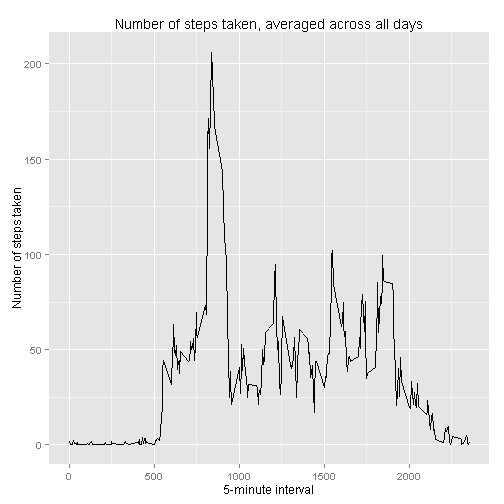
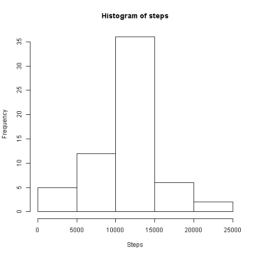
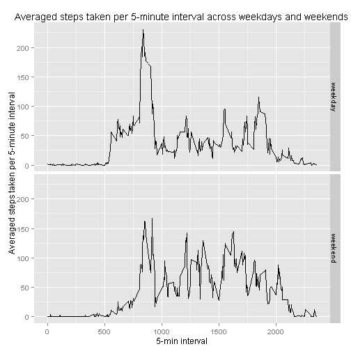

# Reproducible Research: Peer Assessment 1


## Loading and preprocessing the data
## LOAD ggplot2 AND chron

```r
library(ggplot2)
library(chron)

data <- read.csv("activity.csv")
```

## What is mean total number of steps taken per day?

```r
steps <- tapply(data$steps, data$date, sum, na.rm = TRUE)

hist(steps, xlab = "Steps")
```


```r
mean.steps <- mean(steps)
median.steps <- median(steps)

cat(paste("Mean total number of steps taken each day is", 
          round(mean.steps, digits = 2)))
```

```
## Mean total number of steps taken each day is 9354.23
```

```r
cat(paste("Median total number of steps taken each day is", 
          round(median.steps, digits = 2)))
```

```
## Median total number of steps taken each day is 10395
```


## What is the average daily activity pattern?

```r
steps <- tapply(data$steps, data$interval, mean, na.rm = TRUE)
x <- as.numeric(names(steps))

qplot(x, steps, geom = "line", xlab = "5-minute interval", 
      ylab = "Number of steps taken", main = "Number of steps taken, averaged across all days")
```



```r
max.steps <- as.numeric(names(steps)[which.max(steps)])
cat(paste("The 5-minute interval that, on average, contains the maximum number of
          steps is", max.steps, "with maximal number of steps", 
          round(max(steps), digits = 2)))
```

```
## The 5-minute interval that, on average, contains the maximum number of
##           steps is 835 with maximal number of steps 206.17
```

## Imputing missing values

```r
total.miss <- sum(is.na(data$steps))
cat(paste("Total number of missing values in dataset is", total.miss))
```

```
## Total number of missing values in dataset is 2304
```

Strategy for filling in all of the missing values in the dataset: for missing values
in interval 'k' is used 'k'th value of average daily activity pattern.


```r
for (k in seq_along(x)){
  data$steps[is.na(data$steps)][data$interval[is.na(data$steps)] == x[k]] <- as.numeric(steps[k])
}

steps <- tapply(data$steps, data$date, sum, na.rm = TRUE)

hist(steps, xlab = "Steps")
```



```r
mean.steps <- mean(steps)
median.steps <- median(steps)

cat(paste("Mean total number of steps taken each day is", 
          round(mean.steps, digits = 2)))
```

```
## Mean total number of steps taken each day is 10766.19
```

```r
cat(paste("Median total number of steps taken each day is", 
          round(median.steps, digits = 2)))
```

```
## Median total number of steps taken each day is 10766.19
```

Mean and median values are higher after filling missing data. Before filling missing
data there were NA's values. After filling missing data there were imputed positive
values so total steps values for several days are higher and that´s why mean and 
median values are higher. 

## Are there differences in activity patterns between weekdays and weekends?

```r
type.day.bool <- is.weekend(as.Date(data$date))
type.day <- character()
type.day[type.day.bool] <- "weekend"
type.day[!type.day.bool] <- "weekday"
data$type_day <- type.day

steps <- data.frame(tapply(data$steps, list(data$interval, data$type_day), mean))
steps_min <- c(steps$weekday, steps$weekend)
type_day <- rep(c("weekday", "weekend"), each = nrow(steps))
x <- rep(as.numeric(rownames(steps)), times = 2)
steps <- data.frame(x, steps_min, type_day)


p <- qplot(x, steps_min, data = steps, geom = "line", facets = .~type_day, 
          xlab = "5-min interval", 
          ylab = "Averaged steps taken per 5-minute interval", 
          main = "Averaged steps taken per 5-minute interval across weekdays and weekends")
print(p)
```


